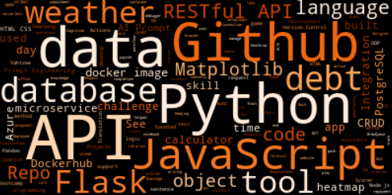

# A series of Web Scrapers

### Using BS4 (Beautiful Soup) to scrape a HTML page

### Using Selenium to scrape my JavaScript Portfolio page

In both cases I used the scraped data to generate my Skills Wordcloud for my GitHub portfolio and for the footer image on my portfolio website, hosted by GitHub pages [here](https://annwyl21.github.io/)

### Using PyPDF2 to scrape my cv.pdf
and using Regex to extract:
- my email
- my portfolio URL

###### Work in Progress
- learning to use Camelot to scrape tables from pdf's

Word Cloud created using data scraped from my portfolio page:
